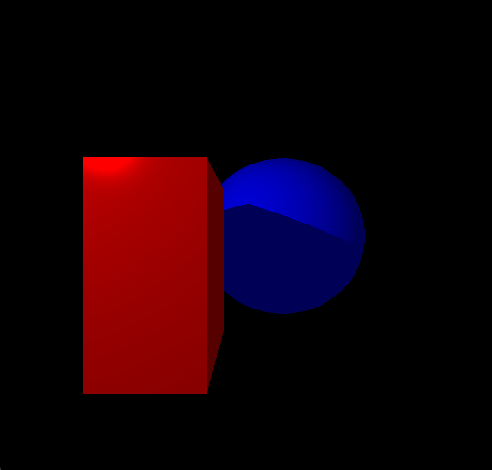

# Ray Tracing Shader
A basic ray tracing shader made in GLSL.

# Installation
The following java libraries are not included but required to run this program:

- JOGL
- JOML

Both must be installed to your computer's global variables as CLASSPATH variables.

The program can be run by executing "compute.bat" (only required the first time), then "run.bat". "compile+run.bat" can also be used to execute both at once.

# Features
- Static ray casting with lighting and shadows

# Screenshots

# Credits
Utils.java and ImportedModel.java made by Scott Gordon at California State University, Sacramento.